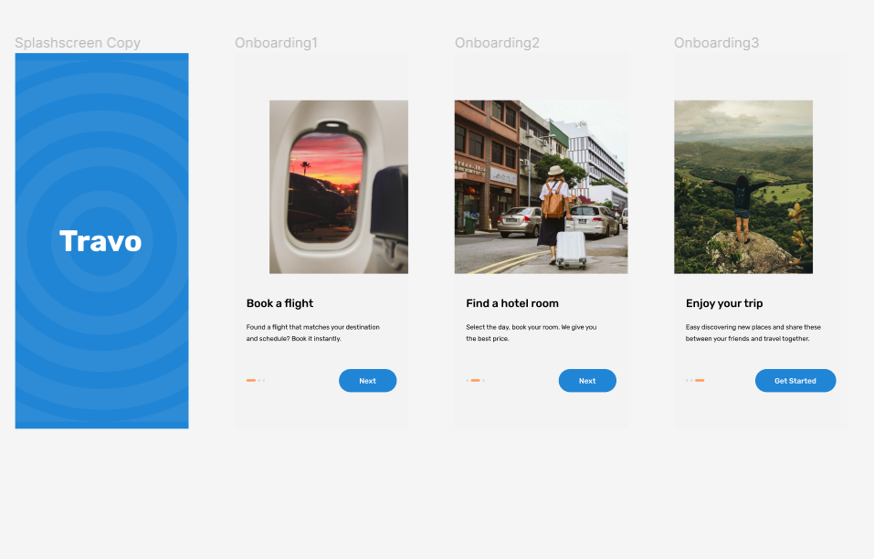
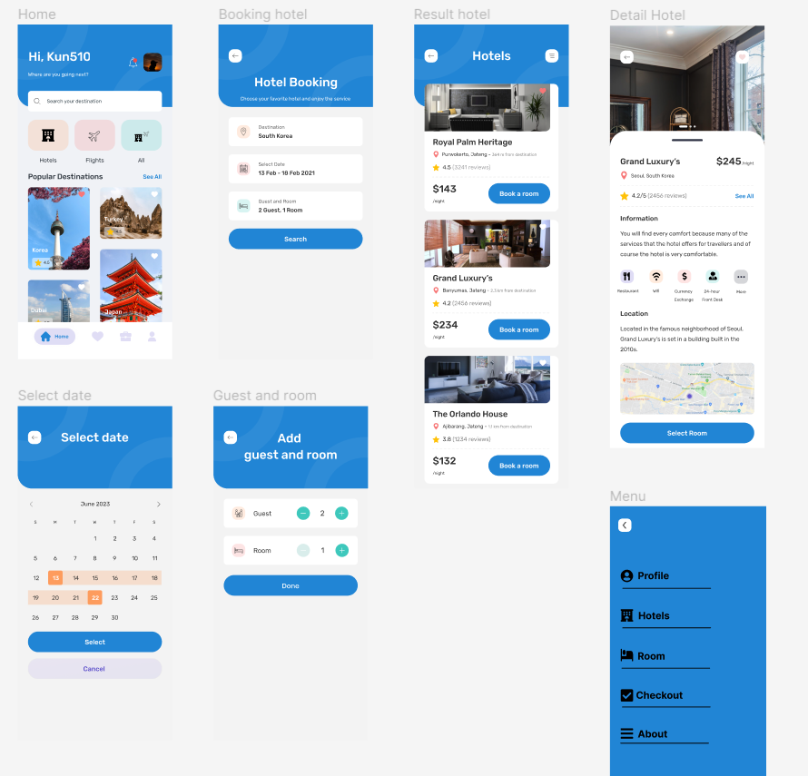

# Flutter App Travel

# Clone for https://200lab.io

how to run App!
step 1: dowload project.
step 2: terminal write "flutter put get"
step 3: experience UX UI

## Getting Started

This project is a starting point for a Flutter application.

A few resources to get you started if this is your first Flutter project:

- [Lab: Write your first Flutter app](https://docs.flutter.dev/get-started/codelab)
- [Cookbook: Useful Flutter samples](https://docs.flutter.dev/cookbook)

For help getting started with Flutter development, view the
[online documentation](https://docs.flutter.dev/), which offers tutorials,
samples, guidance on mobile development, a full API reference.

  

  

